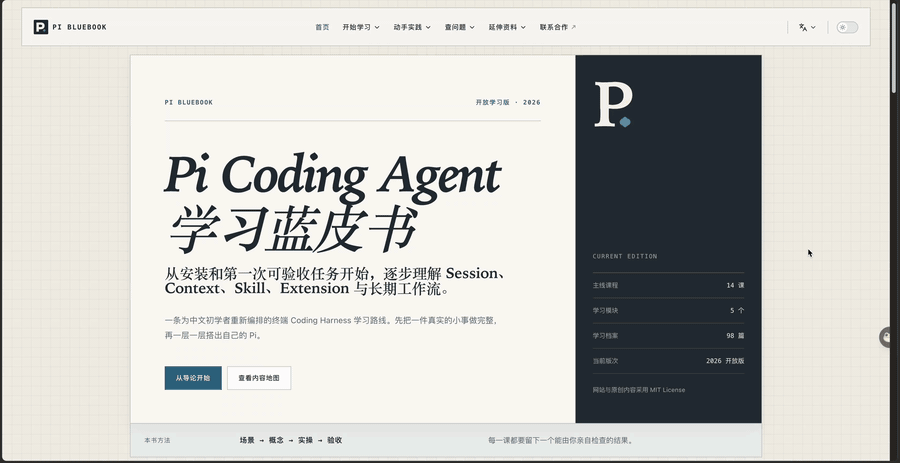

# Pi 学习蓝皮书｜Pi Coding Agent 中文学习路线

一本面向中文初学者的非官方 Pi Coding Agent（极简终端 Coding Harness）学习手册。从安装、登录和第一个可验收任务开始，逐步掌握 Session、Context、Skill、Extension、Subagent 与长期 Agent 工作流。

[](https://github.com/xiaomoBoy/pi-bluebook/actions/workflows/quality.yml) [](LICENSE)



[在线阅读](https://pi.xiaomovps.com) · [直接开始操作](https://pi.xiaomovps.com/guide/start-here) · [系统阅读](https://pi.xiaomovps.com/guide/introduction) · [反馈问题](https://github.com/xiaomoBoy/pi-bluebook/issues) · [繁體中文版](README_zh-TW.md)

## 这是什么

- **真实学习路线**：不从功能清单开始，而是先完成一件可以亲自检查结果的小任务，再逐步进入会话、上下文、扩展和长期工作流。
- **面向中文初学者**：同时提供 macOS 与 Windows Git Bash 路径，命令、Pi 内部操作和任务文字分开说明。
- **强调独立验收**：每一课按“场景 → 概念 → 实操 → 验收”展开，不把 Agent 自述“完成了”当作完成。
- **持续核验更新**：版本、认证、模型和命令等易变化信息会标注核验日期，并以 [Pi 官方文档](https://pi.dev/docs/latest) 和 [官方源码](https://github.com/earendil-works/pi-mono) 为准。

## 当前内容与学习路径

2026 开放学习版的读者对象、阅读顺序、基本主张和内容边界已经确定；网站仍会持续校订错字、失效命令、链接和核验日期。当前导论、序章、五个模块、14 课和 8 个配套案例，已经形成从理解 Pi、完成第一次任务、管理会话与上下文，到扩展、分工、长任务和安全验收的完整学习路径。需要真实系统界面的进阶效果会明确标出，不用文字或伪图代替实测。

| 顺序 | 章节 | 你会完成什么 |
| --- | --- | --- |
| 导论 | [为什么要读这本 Pi 蓝皮书](docs/guide/introduction.md) | 理解 Pi 的位置、中文初学者的真实门槛和本版主张 |
| 长期判断 | [从 98 条推文留下的十条判断](docs/guide/lasting-principles.md) | 区分原始学习档案与截至本版仍然成立的判断 |
| 凡例 | [2026 开放学习版说明](docs/guide/edition-2026.md) | 明确平台路径、核验截止、维护规则和版权边界 |
| 序章 | [Pi 作者 Mario Zechner](docs/guide/mario-zechner.md) | 沿完整时间线理解 libGDX、RoboVM、Pi 与 Earendil 之间的联系 |
| 模块一 · 1 | [安装前检查](docs/guide/before-install.md) | 打开终端，准备练习目录，检查 Node.js 和 npm |
| 模块一 · 2 | [安装并启动 Pi](docs/guide/install-pi.md) | 安装 Pi，确认可用，并学会启动与退出 |
| Windows 路径 | [Windows 中文安装路径](docs/guide/windows-setup.md) | 用 Git Bash 准备环境、安装 Pi，并接入第 3 课 |
| 模块一 · 3 | [登录与模型设置](docs/guide/connect-model.md) | 连接可用服务，选择模型，收到一次真实回复 |
| 模块一 · 4 | [从练习目录开始](docs/guide/ready-to-work.md) | 确认当前目录和基础设置，完成进入任务前的检查 |
| 安装后维护 | [更新、退出登录与卸载](docs/guide/lifecycle-management.md) | 管理 Pi 版本、认证、Package 和本地数据 |
| 模块二 · 5 | [第一次任务](docs/guide/first-task.md) | 把虚构会议记录整理成行动清单，独立核对输入与输出 |
| 模块二 · 6至7 | [文件与会话](docs/guide/files-and-context.md) | 用工作目录和 `@文件` 建立清晰起点，学会会话命名、续写和分支 |
| 模块三 · 8至9 | [上下文与压缩](docs/guide/context-and-compaction.md) | 理解长对话、压缩、提示缓存和可持续产物 |
| 模块四 · 10至12 | [扩展自己的 Pi](docs/guide/skills-extensions-packages.md) | 区分 Skill、Extension 和 Package，理解 Extension 设计与子 Agent 分工 |
| 模块五 · 13至14 | [稳定工作流](docs/guide/vps-and-long-running.md) | 处理长时间任务，建立权限、隔离、恢复和验收意识 |
| 实操案例 | [案例库](docs/cases/index.md) | 用 7 个单项实验和 1 个毕业项目，依次练习文件任务、压缩、扩展、分工、恢复、安全与完整 Agent 工作流 |
| 参考手册 | [主题索引](docs/reference/index.md) | 按问题查找核心机制、操作入口、能力边界与延伸阅读 |
| 插件推荐 | [选择地图](docs/plugins/index.md) | 从推文实践中整理当前可核验的插件来源、适用场景和风险边界 |
| 小墨札记 | [写在蓝皮书之外](docs/journey/index.md) | 单独保留个人感悟、踩坑记录与 98 条推文档案 |
| Earendil 官方授权译文 | [译文专区](docs/translations/index.md) | 经 Earendil 授权发布的十一篇 Pi、Harness、会话机制、代码质量与公司愿景文章完整中文译文 |

另有[内容整理](docs/cases/content-workflow.md)和[小型代码修复](docs/cases/code-repair.md)两项迁移练习，帮助读者把验收方法用到不同任务。

已经能够启动 Pi 并获得回复的读者，可以先检查第 4 课的前置条件，再进入第一次任务。主线以 macOS 为基础，Windows 用户可通过独立中文路径完成安装，再使用 Git Bash 继续后续课程。

当前仍未验收的是 Windows 真实界面截图，以及 Extension 桌面通知的完整系统证据；取得对应实机后再补入，不用模拟图或终端文字代替。新的个人实践只有在来源和操作重新核验后才会进入本版。

## 本地运行网站

本仓库使用 VitePress。预览和修改网站不需要安装 Pi，也不需要模型账号或 API Key。

先准备 Git、Node.js 和 npm。仓库的 [.nvmrc](.nvmrc) 指定 Node.js 22；这里是网站开发环境，与课程中 Pi 自身的运行要求分别说明。

```bash
git clone https://github.com/xiaomoBoy/pi-bluebook.git
cd pi-bluebook
npm ci
npm run docs:dev
```

打开终端显示的本地地址即可预览；修改 `docs/` 下的文件后，页面会自动更新。停止预览时，在该终端按 `Ctrl+C`。

只维护网站或预览内容不需要 Python。需要同步繁体版本时，先运行 `python3 -m pip install -r requirements-dev.txt`，再运行 `npm run sync:zh-tw`；生成结果仍需人工校对台湾常用术语和页面排版。运行 `npm run check:translations` 可只读检查繁体生成内容是否与当前简体和词表一致，CI 也会执行这一检查。

检查正式构建并预览构建结果：

```bash
npm run docs:check
npm run docs:preview
```

`docs:check` 会依次检查内容资源引用和双语结构、完成正式构建，并核对 SEO、页面锚点与搜索产物。构建结果生成在 `docs/.vitepress/dist/`，无需提交到仓库。`docs:preview` 预览的是上一次构建结果，内容有变化时请重新检查。

## 目录结构

```text
pi-bluebook/
├── docs/
│   ├── index.md                 # 网站首页
│   ├── zh-TW/                   # 从简体正文生成的繁体版本
│   ├── guide/                   # 按学习顺序编写的课程
│   ├── cases/                   # 与课程模块对应的可复现实操
│   ├── reference/               # 按主题查询的参考手册
│   ├── plugins/                 # 从推文实践整理的插件选择与核验清单
│   ├── journey/                 # 蓝皮书之外的个人札记
│   ├── translations/            # Earendil 官方授权中文译文
│   ├── tweets/                  # 推文与实践资料索引
│   ├── public/
│   │   ├── examples/            # 可下载的练习材料
│   │   ├── examples-tw/         # 生成的繁体练习材料
│   │   └── images/              # 教程图片
│   └── .vitepress/
│       ├── config.mts           # 站点、SEO、搜索和页脚配置
│       ├── config/              # 顶部导航与各板块侧栏
│       └── theme/styles/        # 按职责拆分的页面主题样式
├── scripts/                     # 内容与正式产物检查
├── .github/workflows/           # 自动化质量检查
├── MAINTENANCE.md               # 工程结构与维护入口
├── CONTRIBUTING.md             # 反馈与贡献说明
├── EDITORIAL_WORKFLOW.md        # 文章审阅、核验与发布流程
├── LICENSE                     # 网站代码许可
└── LICENSE-CONTENT.md           # 原创内容许可
```

## 一起完善这本书

欢迎指出看不懂的步骤、失效命令、缺少的材料或错误链接，也欢迎补充有来源的实践记录和修正文案。你不需要会写代码才能贡献：在 [Issues](https://github.com/xiaomoBoy/pi-bluebook/issues) 写清所读章节、卡住的位置和实际现象即可。

提交修改前请阅读 [贡献指南](CONTRIBUTING.md)。文章从原始材料到发布的分工与验收方式见 [文章工作流](EDITORIAL_WORKFLOW.md)。

## 许可证

本仓库的网站代码、原创书稿、推文整理稿和原创图片统一采用 [MIT License](LICENSE)。
你可以使用、修改和分发，也可以用于商业用途；分发本项目的全部或重要部分时，需要
保留原版权声明和许可证。具体说明见[内容许可](LICENSE-CONTENT.md)。

- `docs/translations/` 中十一篇 Earendil 官方授权译文及适配部分采用 [CC BY 4.0](LICENSE-CONTENT.md)，英文原文版权归 Earendil 所有。
- 第三方商标、截图、引用和其他第三方素材不自动包含在原创内容许可中，其权利归各自权利人所有；素材旁的单独说明优先。

具体权利和条件以许可文件为准。

## 非官方声明

本项目为社区学习项目，与 Pi 官方无隶属或授权关系。Pi 的安装方式、认证支持和版本行为可能变化；课程中的动态说明应结合所标注的核验日期及 [Pi 官方文档](https://pi.dev/docs/latest/quickstart) 阅读。
